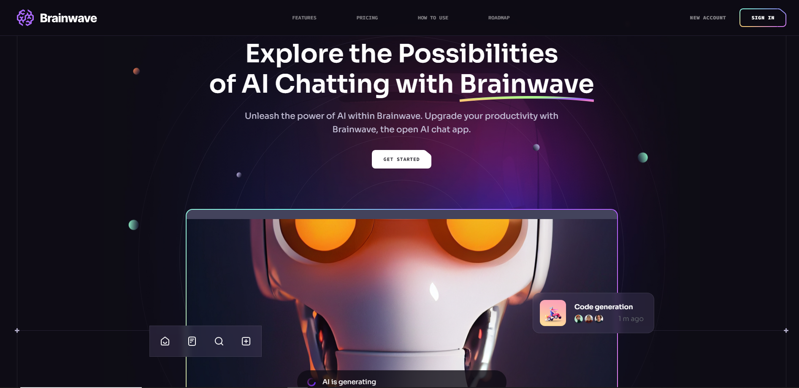

<h3 align="center"> AI Modern UI/UX Website</h3>

 <div>
    
    
  </div>

## 🤖 Introduction

Brainwave - Modern UI/UX website, developed using React.js and Tailwind CSS with the help of Javascript Mastery , exemplifies modern UI/UX principles. Its sleek design, seamless animations, and overall user experience set a high standard, serving as a reference or inspiration for future modern applications or websites in general.

## ⚙️ Tech Stack

- React.js
- Tailwind CSS

## Screens

**On Desktop screens**



**On Tablet screens**


**On mobile screens**


## 🔋 Features

👉 **Beautiful Sections**: Includes hero, services, features, how to use, roadmap, pricing, footer, and header.

👉 **Parallax Animations**: Engaging effects triggered by mouse movement and scrolling

👉 **Complex UI Geometry**: Utilizes tailwindcss for intricate shapes like circular feature displays, grid lines, and side lines.

👉 **Latest UI Trends**: Incorporates modern design elements such as bento grids.

👉 **Cool Gradients**: Enhances visuals with stylish gradients using Tailwind CSS for cards, buttons, etc.

👉 **Responsive**: Ensures seamless functionality and aesthetics across all devices

and many more, including code architecture and reusability

## 🤸 Quick Start

Follow these steps to set up the project locally on your machine.

**Prerequisites**

Make sure you have the following installed on your machine:

- [Git](https://git-scm.com/)
- [Node.js](https://nodejs.org/en)
- [npm](https://www.npmjs.com/) (Node Package Manager)

**Cloning the Repository**

```bash
git clone https://github.com/JavaScript-Mastery-Pro/brainwave.git
cd brainwave
```

**Installation**

Install the project dependencies using npm:

```bash
npm install
```

**Running the Project**

```bash
npm run dev
```

Open [http://localhost:3000](http://localhost:3000) in your browser to view the project.

Thanks for your support